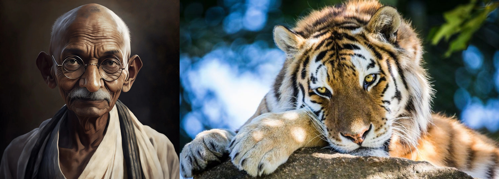

<h1 align="center">AI IMAGE CLASSIFIER</h1>


# Table of Contents
- Table of Contents
- Basic Overview
- Demo
- Data Collection
- Data Preprocessing
- Model Designing
- Results and Testing
- Deployment

# Basic Overview :
This Project is an attempt to to classify **AI Generated Images** and **Real Images**. In this growing world of AI a lot of images are changed and manipulated via AI techniques
might lead to propogation of misinformation. Here I have made an effort to resolve such issues.
# :film_projector: Demo :
https://github.com/Aasneh/AI_Image_Classifier/assets/96459729/f2e393f4-f87a-47c1-a093-4922d350ec00


# :floppy_disk:  Data Collection :
* Using Selenium and Beautiful Soup modules of python I have webscraped some images from google images.<br>
The **XPATH** of the images had a certain pattern :
```javascript
*[@id="islrg"]/div[1]/div[%i]/a[1]/div[1]/img where i is any positive integer.
```
* We can extract the **url** of the image using the **scr** attribute and download the image.<br>
* However we had some non-image containers on the web page and they were uniformly occuring on every next 25th interval and hence we rejected them.<br>
* Keywords used to search AI generated Images used : **ai generated images**, **dalle2 generated images** <br>
* Keywords used to search Real Images used : **animals**, **humans**, **cityscape** <br>
* However Webscarping is time consuming and images on the web have a lot of non-uniformity. So I also took help of the <https://www.kaggle.com/datasets/birdy654/cifake-real-and-ai-generated-synthetic-images>
dataset available on kaggle.<br>
* Hence the model was trained on **6000 FAKE** and **6000 REAL** Images. It was tested on **2000** images consisting of both real and fake images.<br>

# :page_with_curl:  Data Preprocessing :
* Since all the images are not of the same sizes and shapes, we reshaped all of them to a uniform size of **(36x36)**. We have generated an array for each image of size
**(36,36,3)** (RGB Images).<br>
* Each **2-D matrix** handles individually the components of **red, blue, green** pixels.
* Shuffled the dataset to ensure randomness.<br>

# :pushpin:  Model Designing :
* **Convolutional Neural Networks (CNNs)** is the most popular neural network model being used for Image Classification Problems.
* The main idea behind CNNs is that a local understanding of an image is good enough. Instead of a **fully connected network of weights from each pixel**, 
a CNN has just enough weights to look at a small patch of the image. 
* It’s like reading a book by using a magnifying glass; eventually, you read the whole page, but you look at only a small patch of the page at any given time.<br>
Hence we decided to move forward with the **CNN type Architecture .**
### MAIN ARCHITECTURE:
* **Input_Shape=((36,36,3))**<br>
* **4 CNN LAYERS :** each having **filters**, **kernel size**=(3,3), **padding**, **relu Activation function**, **Max Pooling**, **Dropout** .<br>
* **3 FULLY CONNECTED DENSE LAYERS :** first two having **relu Activation function**, **Dropout** and last layer has **sigmoid Activation** .<br>
* **OPTIMIZER : adams**<br>
* **loss : sparse_categorical_crossentropy**<br><br>

<br>
<br>

* **FILTERS :** Filters help in extracting specific features from theinput data.<br>
* **Kernel_Size :** Kernel size determines the size of matrix which is used for extracting features via filter.<br>
* **Padding :** Padding virtually extends the matrix to cater to border values otherwise their influence is neglected.<br>
* **Max Pooling :** Max Pooling is a pooling operation that calculates the maximum value for patches of a feature map.<br>
* **Dropout :** Certain neurons in layers are dropped out to prevent overfitting.<br>
* **Sigmoid Function is used in last layer as the output is binary** .<br>
* **adams optimizer :** Adaptive Moment Estimation is the technique used to update the gradient descent.Used for sparse data.
* **sparse_categorical_crossentropy :** Used as the outputs belong to certain categories. <br>
* Model Summary Available at <https://github.com/Aasneh/AI_Image_Classifier/blob/main/modelsummary.txt><br>

# :bar_chart:  Results and Testing :
**CLASSIFICATION REPORT**:<br>

<br>
**AI GENERATED IMAGE:**<br>

<br>
**REAL IMAGE:**<br>

<br>
# Deployment
**Deployed on Streamlit. Check it out! :** <https://aiimageclassifier-aasneh.streamlit.app/>

